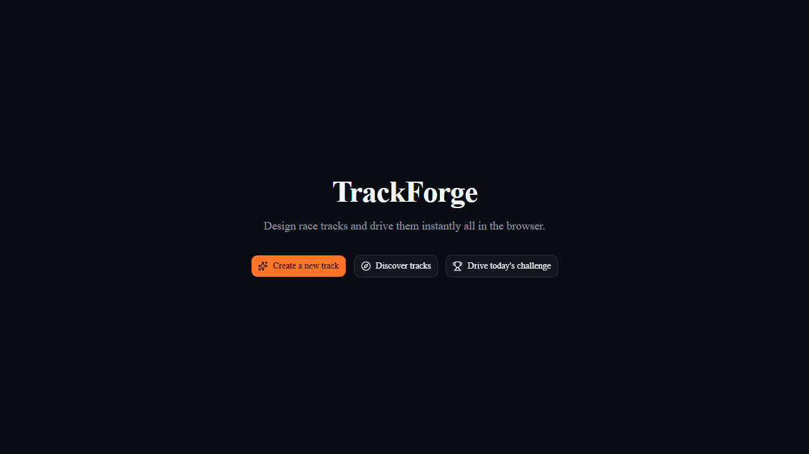
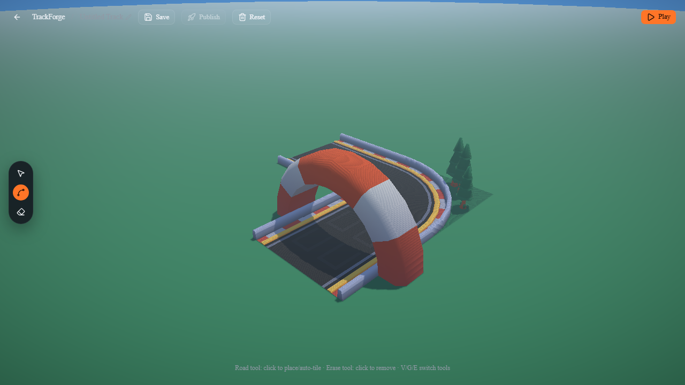
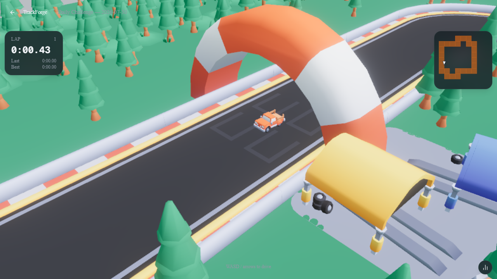

<div align="center">

# TrackForge

**Design race tracks and drive them instantly, all in the browser.**

[Play it live →](https://trackforge.samueljames.dev)

</div>

<br>

<p align="center">
  
</p>

TrackForge is a browser-based track editor and racing game. Build a closed-loop
circuit by clicking tiles into place, then jump straight from the editor into
a fully physics-driven test drive — no build step, no download. Every track
is shareable with a link, and a fresh procedurally-generated **Daily
Challenge** goes live for everyone at midnight IST.

## Features

- 🛠️ **Tile-based track editor** — click to place road, auto-tiling handles
  corners/straights and orientation for you. Undo-free by design: erase and
  redraw instead of tracking history.
- 🏎️ **Real-time 3D driving** — a Three.js scene with a proper (if simplified)
  rolling-sphere vehicle model, drift, particle trails, and adaptive render
  quality that scales itself to whatever device you're on.
- 👻 **Ghost replays** — race against your own best lap, recorded and played
  back automatically.
- 🏆 **Leaderboards & personal bests** — no account needed; pick a display
  name and your times are tracked per track.
- 📅 **Daily Challenge** — a brand new random advanced/expert layout every
  day at IST midnight, same track for everyone, its own leaderboard.
- 🔎 **Discover** — browse, search, and sort every published community track;
  like and comment on the ones you enjoy.
- 📱 **Mobile-first controls** — on-screen steering, auto-throttle, and a
  camera tuned for touch, with quality that adapts to the hardware rather
  than guessing from device type.
- 🔐 **No accounts, ever** — tracks and profiles are tied to your browser,
  not a login. An edit link (and token) is all that's needed to come back
  and keep working on something.

## Screenshots

<p align="center">
  
</p>

<p align="center">
  
</p>

## Tech stack

- **[Next.js](https://nextjs.org)** (App Router) + **React 19** + **TypeScript**
- **[Three.js](https://threejs.org)** for the 3D scene and vehicle physics
- **[Tailwind CSS v4](https://tailwindcss.com)** + **shadcn/ui**
- **[Prisma](https://www.prisma.io)** + **PostgreSQL**
- Deployed on **[Vercel](https://vercel.com)**

## Getting started

### Prerequisites

- Node.js 20+
- Docker (for a local Postgres instance) — or any Postgres connection string

### Setup

```bash
git clone https://github.com/samuel7james/TrackForge.git
cd TrackForge
npm install

# Start a local Postgres container
docker compose up -d

# Copy the example env file and fill in your own values
cp .env.example .env

# Apply the database schema
npx prisma migrate dev

npm run dev
```

Open [http://localhost:3000](http://localhost:3000).

See `.env.example` for every environment variable the app reads and what
each one is for — nothing beyond that file is required to run it locally.

## Credits

TrackForge's driving/editor engine started from the ideas in
**[mrdoob](https://github.com/mrdoob)**'s
**[Starter-Kit-Racing](https://github.com/mrdoob/Starter-Kit-Racing)** —
massive thanks for the inspiration behind getting a car moving around a
track in Three.js in the first place. Nearly everything around that core
(the tile-based editor, the whole backend, leaderboards, ghosts, the daily
challenge, and a lot of the engine code itself) has since been rebuilt and
extended, but the original spark for the idea belongs there.

Also built on [crashcat](https://github.com/isaac-mason/crashcat) for
physics, and the many open-source packages listed in `package.json`.

## License

MIT — see [LICENSE](LICENSE).
